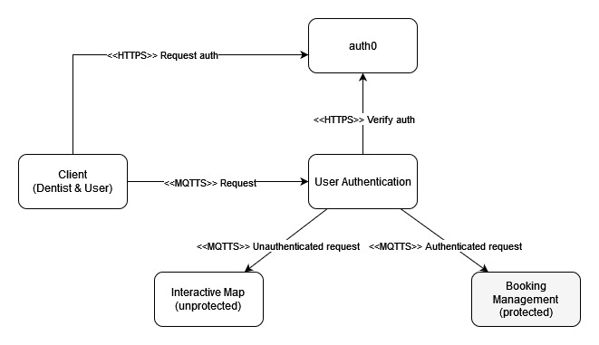

# User Authentication

This is a user authentication component that is part of [Dentistimo](https://git.chalmers.se/courses/dit355/dit356-2022/t-6/t6-project). This component acts as a gateway for all traffic between the clients and the other components, it ensures all requests are authorized and authenticated. Built with [auth0](https://auth0.com/), [MQTT.js](https://github.com/mqttjs) and [Node.js](https://nodejs.org/).

## Visuals

This diagram shows the interaction and purpose of thi component

## Installation

## Usage

## Authors and acknowledgment

Felix Valkama, Qianyuan Wang

## License

