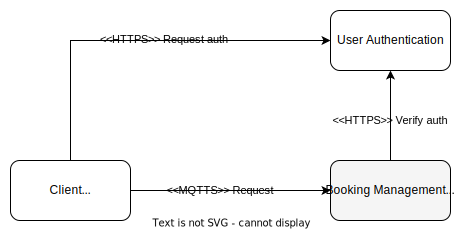

# User Management

This is the user management component that is part of [Dentistimo](https://git.chalmers.se/courses/dit355/dit356-2022/t-6/t6-project). This component manages all users and is responisble for database communication for everything regarding users. 

Built with:

[MQTT.js v4.3.7](https://github.com/mqttjs), [Node.js v18.12.1](https://nodejs.org/), [Mongoose v6.8.0](https://mongoosejs.com/), [bcrypt v5.1.0](https://www.npmjs.com/package/bcrypt?activeTab=readme), [jsonwebtoken v8.5.1](https://www.npmjs.com/package/jsonwebtoken), [opossum v7.0.1](https://github.com/nodeshift/opossum)

## Visuals

This diagram shows the interaction and purpose of this component.



## Installation

```
1. git clone 
2. cd user-management
3. npm i
4. npm run start

```

## Usage

To use this component, you first need to install it by following the installation instructions above. 
Then you can use either a dedicated MQTT program (like [MQTTX](https://mqttx.app/)) to send requests to it, or you can send requests from another component.

## Authors and acknowledgment

Felix Valkama, Qianyuan Wang

## License
